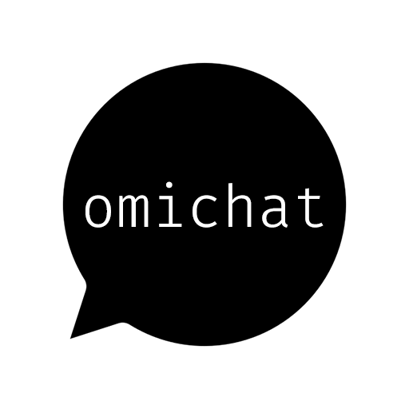

<!-- ANCHOR: intro -->

OmiChat is a mod for [Project Zomboid](https://projectzomboid.com) that extends chat functionality.
It's available on the [Steam workshop](https://steamcommunity.com/sharedfiles/filedetails/?id=3178882070).

<!-- ANCHOR_END: intro -->

For details, please see the [documentation](https://omarkmu.github.io/pz-omichat)!

<!-- ANCHOR: content -->

## Features

This mod aims to be as extensible and configurable as possible.
The vast majority of the features in the mod can be configured or completely disabled via [sandbox options](https://omarkmu.github.io/pz-omichat/sandbox-options).

- Customization of names, timestamps, all chat types, and more via powerful chat [formats](https://omarkmu.github.io/pz-omichat/format-strings)
- Chat color [customization](https://omarkmu.github.io/pz-omichat/user-guide/chat-settings.html#color-customization)
- Name color [customization](https://omarkmu.github.io/pz-omichat/sandbox-options/basic-features.html#enablesetnamecolor)
- Speech bubble color [customization](https://omarkmu.github.io/pz-omichat/sandbox-options/basic-features.html#enablesetspeechcolor)
- Callout [customization](https://omarkmu.github.io/pz-omichat/user-guide/chat-settings.html#callout-customization)
- Character naming with [`/name`](https://omarkmu.github.io/pz-omichat/sandbox-options/basic-features.html#enablesetname)
- Character [customization](https://omarkmu.github.io/pz-omichat/sandbox-options/basic-features.html#enablecharactercustomization) (off by default)
- Chat [buffs](https://omarkmu.github.io/pz-omichat/sandbox-options/filters-predicates.html#predicateapplybuff) (off by default)
- Display of chat names in [menus](https://omarkmu.github.io/pz-omichat/sandbox-options/component-formats.html#formatmenuname) (Trading, Medical Check)
- Local [`/whisper`](https://omarkmu.github.io/pz-omichat/sandbox-options/chat-formats.html#chatformatwhisper) chat
- Local [`/card`](https://omarkmu.github.io/pz-omichat/sandbox-options/chat-formats.html#chatformatcard) and [`/roll`](https://omarkmu.github.io/pz-omichat/sandbox-options/chat-formats.html#chatformatroll)
- Roleplay descriptions with [`/me`](https://omarkmu.github.io/pz-omichat/sandbox-options/chat-formats.html#chatformatme) and [`/do`](https://omarkmu.github.io/pz-omichat/sandbox-options/chat-formats.html#chatformatdo)
- Range-based chat streams (`/mequiet`, `/meloud`, `/doquiet`, `/doloud`)
- Input suggestion box
- Emote animation [shortcuts](https://omarkmu.github.io/pz-omichat/user-guide/emote-shortcuts.html) (.clap, .salute, .surrrender, etc.)
- Roleplay [languages](https://omarkmu.github.io/pz-omichat/sandbox-options/languages.html)
- Compatibility with [True Actions Act 3 - Dancing](https://steamcommunity.com/sharedfiles/filedetails/?id=2648779556) with [`/dance`](https://omarkmu.github.io/pz-omichat/sandbox-options/compatibility-features.html#enablecompattad)
- Chat range [options](https://omarkmu.github.io/pz-omichat/sandbox-options/ranges.html)
- Info text [option](https://omarkmu.github.io/pz-omichat/sandbox-options/component-formats.html#formatinfo)
- Typing [indicator](https://omarkmu.github.io/pz-omichat/sandbox-options/filters-predicates.html#predicateshowtypingindicator) (off by default)
- Various other options for chat customization
- API for extension by other mods

## Credits

Thank you to the translators!
- French: [Inkredibehl](https://github.com/Inkredibehl)
- Korean: 우로

If you'd like to see the mod translated into your language, please [contribute](https://github.com/omarkmu/pz-omichat/blob/main/.github/CONTRIBUTING.md#contributing-translations)!  
Some features were inspired by [buffy's roleplay chat](https://steamcommunity.com/sharedfiles/filedetails/?id=2688851521).  

<!-- ANCHOR_END: content -->
