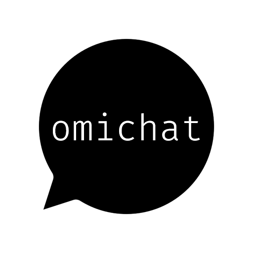

<!-- ANCHOR: intro -->

OmiChat is a mod for [Project Zomboid](https://projectzomboid.com) that extends chat functionality.
The beta is currently available on the [Steam workshop](https://steamcommunity.com/sharedfiles/filedetails/?id=3040299907).

<!-- ANCHOR_END: intro -->

For details, please see the [documentation](https://omarkmu.github.io/pz-omichat)!

<!-- ANCHOR: content -->

## Features

This mod aims to be as extensible and configurable as possible.
The vast majority of the features listed below can be configured or completely disabled via [sandbox options](https://omarkmu.github.io/pz-omichat/sandbox-options).
This is not a comprehensive list; please see the documentation.

- Customization of names, timestamps, all chat types, and more via powerful chat [formats](https://omarkmu.github.io/pz-omichat/format-strings)
- Chat color [customization](https://omarkmu.github.io/pz-omichat/user-guide/chat-settings.md#color-customization)
- Name color [customization](https://omarkmu.github.io/pz-omichat/sandbox-options/basic-features.md#enablesetnamecolor)
- Speech bubble color [customization](https://omarkmu.github.io/pz-omichat/sandbox-options/basic-features.md#enablesetspeechcolor)
- Callout [customization](https://omarkmu.github.io/pz-omichat/sandbox-options/basic-features.md#enablecustomshouts)
- Character naming with [`/name`](https://omarkmu.github.io/pz-omichat/sandbox-options/basic-features.md#enablesetname)
- Character [customization](https://omarkmu.github.io/pz-omichat/sandbox-options/basic-features.md#enablecharactercustomization) (off-by-default)
- Chat [buffs](https://omarkmu.github.io/pz-omichat/sandbox-options/filters-predicates.md#predicateapplybuff) (off-by-default)
- Display of chat names in [menus](https://omarkmu.github.io/pz-omichat/sandbox-options/component-formats.md#formatmenuname) (Trading, Medical Check)
- Local [`/whisper`](https://omarkmu.github.io/pz-omichat/sandbox-options/chat-formats.md#chatformatwhisper) chat
- Local [`/card`](https://omarkmu.github.io/pz-omichat/sandbox-options/chat-formats.md#chatformatcard) and [`/roll`](https://omarkmu.github.io/pz-omichat/sandbox-options/chat-formats.md#chatformatroll)
- Roleplay descriptions with [`/me`](https://omarkmu.github.io/pz-omichat/sandbox-options/chat-formats.md#chatformatme) and [`/do`](https://omarkmu.github.io/pz-omichat/sandbox-options/chat-formats.md#chatformatdo)
- Range-based chat streams (`/mequiet`, `/meloud`, `/doquiet`, `/doloud`)
- Input suggestion box
- Emote animation [shortcuts](https://omarkmu.github.io/pz-omichat/user-guide/emote-shortcuts.md) (.clap, .salute, .surrrender, etc.)
- Roleplay [languages](https://omarkmu.github.io/pz-omichat/sandbox-options/languages.md)
- Compatibility with [True Actions Act 3 - Dancing](https://steamcommunity.com/sharedfiles/filedetails/?id=2648779556) with [`/dance`](https://omarkmu.github.io/pz-omichat/sandbox-options/compatibility-features.md#enablecompattad)
- Chat range [options](https://omarkmu.github.io/pz-omichat/sandbox-options/ranges.md)
- Info text [option](https://omarkmu.github.io/pz-omichat/sandbox-options/component-formats.md#formatinfo)
- API for extension by other mods

## Credits

Thank you to 우로 for providing Korean translations.
If you'd like to see the mod translated into your language, please [contribute](https://github.com/omarkmu/pz-omichat/blob/main/.github/CONTRIBUTING.md)!

Some features were inspired by [buffy's roleplay chat](https://steamcommunity.com/sharedfiles/filedetails/?id=2688851521).  

<!-- ANCHOR_END: content -->
