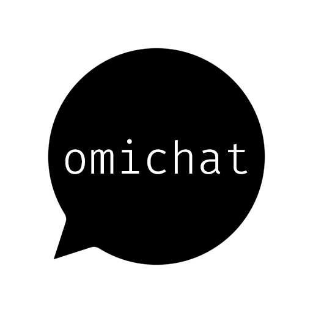

<!-- ANCHOR: intro -->

OmiChat is a mod for [Project Zomboid](https://projectzomboid.com) that extends chat functionality.
It's available on the [Steam workshop](https://steamcommunity.com/sharedfiles/filedetails/?id=3178882070).

<!-- ANCHOR_END: intro -->

For details, please see the [documentation](https://omarkmu.github.io/pz-omichat)!

<!-- ANCHOR: content -->

## Features

This mod aims to be as extensible and configurable as possible.
The vast majority of the features in the mod can be configured or completely disabled via the configuration.

- Chat color customization
- Speech bubble color customization
- Callout customization
- Character naming with `/name`
- Profiles for character switching
- Character customization options (grow hair/beard, change hair color)
- Roleplay chat buffs
- Display of chat names in menus (Trading, Medical Check)
- Local `/whisper` chat
- `/card`, `/roll`, and `/flip` commands.
- Roleplay descriptions with (`/me`, `/do`, etc.)
- Range-based chat streams
- Input suggestion box
- Emote animation shortcuts (.clap, .salute, .surrrender, etc.)
- Roleplay languages
- Typing indicators (off by default)
- Compatibility with [True Actions Act 3 - Dancing](https://steamcommunity.com/sharedfiles/filedetails/?id=2648779556) with `/dance` (currently disabled)
- Configurable chat streams
- Configurable info text
- Customization of names, timestamps, all chat types, and more via powerful format strings
- Various admin commands
- Various other options for chat customization
- API for extension by other mods

## Credits

Thank you to the translators!

- French: [Inkredibehl](https://github.com/Inkredibehl)
- Korean: 우로 (Wuro)

If you'd like to see the mod translated into your language, please [contribute](https://github.com/omarkmu/pz-omichat/blob/main/.github/CONTRIBUTING.md#contributing-translations)!  
Some features were inspired by buffy's roleplay chat.

<!-- ANCHOR_END: content -->
