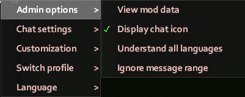
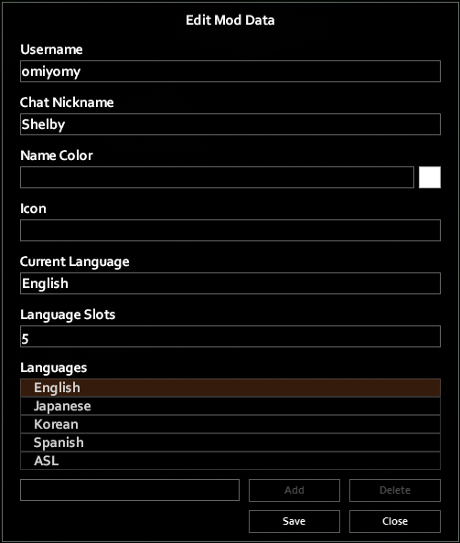
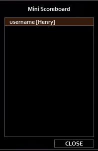

# Admin Utilities

OmiChat offers some utilities for admins to use in-game.

## Admin Menu

When the player has admin access, the gear button's context menu has an `Admin options` entry that offers toggles for mod-specific admin powers.

The chat icon used for the **display chat icon** option is controlled by [`FormatAdminIcon`](../sandbox-options/component-formats.md#formatadminicon).

The **view mod data** option can be used to open a mod data viewer that displays data for all players, including those offline.
It can also be used to modify mod data.

## Commands

There are various commands to control player names, languages, and icons.

| Command | Description |
| ------- | ----------- |
| `/setname <username> <name>` | Sets the chat name of a player. |
| `/resetname <username>` | Resets the chat name of a player. |
| `/clearnames` | Resets **all** players' chat names. |
| `/seticon <username> <icon>` | Sets the chat icon for a player. |
| `/reseticon <username>` | Clears the chat icon for a player. |
| `/iconinfo <name>` | Gets information about an icon. If provided a valid icon name or alias, it will display the icon. See the partial [list of icons](https://projectzomboid.com/chat_colours.txt) for possible aliases. |
| `/addlanguage <username> <language>` | Adds a known language to a player. `language` must be one of the languages specified in [`AvailableLanguages`](../sandbox-options/languages.md#availablelanguages). |
| `/resetlanguages <username>` | Sets the known languages for a player to only the default language. |
| `/setlanguageslots <username> <amount>` | Sets the [language slots](../sandbox-options/languages.md#languageslots) for a player. `amount` must be in `[1, 50]`. |

## Mini Scoreboard

The “mini scoreboard” included in the admin menu will respect the [`FormatMenuName`](../sandbox-options/component-formats.md#formatmenuname) sandbox option.

By default, this will display players' chat names (as determined by [`FormatName`](../sandbox-options/component-formats.md#formatname)) and usernames, in the format `Username [Name]`.
Mousing over names will display more information.
Admins can use this to determine the username associated with a chat name.

