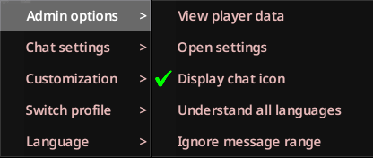
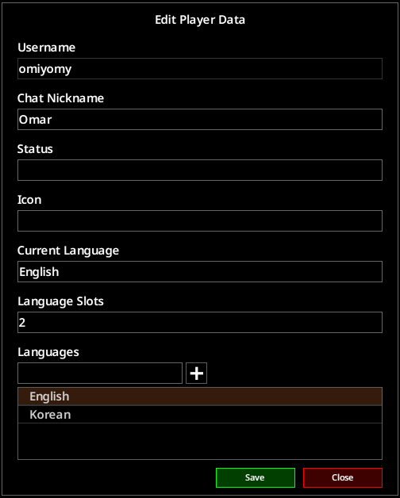
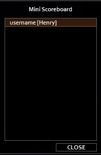

# Admin Utilities

OmiChat offers some utilities for admins to use in-game.

## Admin Menu

When the player has admin access, the gear button's context menu has an `Admin options` entry that offers toggles for mod-specific admin powers.

The chat icon used for the **display chat icon** option is controlled by the [`Admin Icon`](../configuration/general.md#adminicon) configuration option.

The **view mod data** option can be used to open a mod data viewer that displays data for all players, including those offline.
It can also be used to modify mod data.

## Commands

There are various commands to control player names, languages, and icons.

### `/setname`

**Usage**: `/setname <username> <name>`  
Sets the chat name of a player.

### `/resetname`

**Usage**: `/resetname <username>`  
Resets the chat name of a player.

### `/clearnames`

Resets **all** players' chat names.

### `/seticon`

**Usage**: `/seticon <username> <icon>`  
Sets the chat icon for a player.

### `/reseticon`

**Usage**: `/reseticon <username>`  
Clears the chat icon for a player.

### `/iconinfo`

**Usage**: `/iconinfo <name>`  
Gets information about an icon.
If provided a valid icon name or alias, it will display the icon.
See the partial [list of icons](https://projectzomboid.com/chat_colours.txt) for possible aliases.

### `/addlanguage`

**Usage**: `/addlanguage <username> <language>`  
Adds a known language to a player.
`language` must be one of the languages specified the **Languages** configuration.

### `/resetlanguages`

**Usage**: `/resetlanguages <username>`  
Sets the known languages for a player to only the default language.

### `/setlanguageslots`

**Usage**: `/setlanguageslots <username> <amount>`  
Sets the language slots for a player.
`amount` must be in `[1, 50]`.

## Mini Scoreboard

The “mini scoreboard” included in the admin menu will respect the options configured for [`In-Game Names`](../configuration/format.md#menuname).

By default, this will display players' chat names
(as determined by the [name format](../configuration/format.md#component-name)) and usernames,
in the format `Username [Name]`.
Mousing over names will display more information.
Admins can use this to quickly determine the username associated with a chat name.

