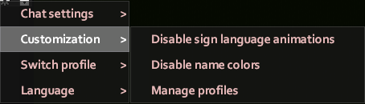

# Chat Settings

In addition to the vanilla settings, OmiChat offers some new settings for players.
With the exception of the [roleplay language](#language-options) settings, these settings will persist across game servers.
You can access the chat settings by clicking on the gear icon at the top right of the chat box.

## Basic settings

Most of the settings within the basic “chat settings” submenu exist in vanilla.
The existing settings work equivalently.
There are two new options in this submenu.

The **suggestions** submenu can be used to control whether suggestions are offered based on chat box input and how those suggestions are accepted.

The **retain commands** submenu can be used to determine whether certain commands are “retained,” so that they are set as the initial input the next time the chat is used.
The submenu contains three options: “Chat,” “RP,” and “Other.”
The first option refers to streams such as `/say`, the second refers to streams like [`/me`](../sandbox-options/chat-formats.md#chatformatme), and the third covers all other commands.

## Customization

The customization settings can be used to tailor the chat to your preferences.

The **enable/disable sign language emotes** option is only shown when the player knows a [signed language](../sandbox-options/languages.md#signedlanguages).
This controls whether a random [emote animation](./emote-shortcuts.md) is played whenever they send a message.

The **enable/disable name colors** option allows players to toggle the appearance of name colors in their chat.
This will only display if either the [`EnableSpeechColorAsDefaultNameColor`](../sandbox-options/basic-features.md#enablespeechcolorasdefaultnamecolor) option or the [`EnableSetNameColor`](../sandbox-options/basic-features.md#enablesetnamecolor) option is enabled.

The **manage profiles** option is used to open the profile manager, which can be used to customize callouts and chat colors.

### Color customization

The profile manager contains a number of options that allow players to control how the various chat streams display in their chat, as well as the color of their overhead chat messages.

For example, to use orange for messages sent with `/yell`, the **/yell color** option can be used.

The available color customization options depend on server configuration.

### Callout customization

The profile manager also includes options that allow players to set custom messages for when they use callouts (bound to the `Q` key, by default).
These rely on the [`EnableCustomShouts`](../sandbox-options/basic-features.md#enablecustomshouts) option.

  

### Character customization

If a server has [character customization](../sandbox-options/basic-features.md#enablecharactercustomization) enabled, the customization submenu also includes QoL character modification options. The available options are self-explanatory.

## Language options

The **Language** submenu will only display for players that know multiple languages or can add new ones.
From this menu, players can select the roleplay language that they want to use in chat.
The currently selected language will be displayed with a checkmark.
The option to add new languages will only be available if a player has more available [language slots](../sandbox-options/languages.md#languageslots) than languages.

Languages other than the default language will display an indicator for the language when used in chat.
Players with characters that don't speak the language will see a chat message indicating that they don't understand it.
