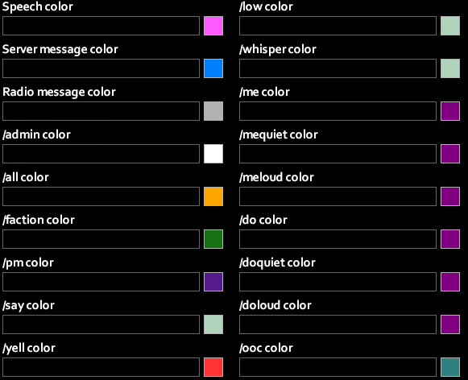
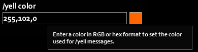

# Chat Settings

In addition to the vanilla settings (timestamps, tags, font size, fade, and opacity), OmiChat offers some new settings for players.
With the exception of the roleplay language settings, these settings will persist across game servers.

## Basic Settings

The **enable/disable name colors** option allows players to toggle the appearance of name colors in their chat.
This will only display if either the [`EnableSpeechColorAsDefaultNameColor`](../sandbox-options/index.md#enablespeechcolorasdefaultnamecolor) option or the [`EnableSetNameColor`](../sandbox-options/index.md#enablesetnamecolor) option is enabled.

**Enable/disable suggestions** can be used to control whether suggestions are offered based on chat box input.

The **enable/disable sign language emotes** option is only shown when the player knows a [signed language](../sandbox-options/index.md#signedlanguages). This controls whether a random [emote](./emotes.md) is played whenever they send a message.

The **retain commands** submenu can be used to determine whether certain commands are “retained,” so that they are set as the initial input the next time the chat is used.
The submenu contains three options, for “Chat,” “RP,” and “Other.”
The first option refers to streams such as `/say`, the second to [`/me`](../sandbox-options/chat-formats.md#chatformatme), and the third covers all other streams (such as commands).

## Callout Customization

The **customize callouts** and **customize sneak callouts** options allow players to set custom messages for when they use callouts (bound to the `Q` key, by default).
These rely on the [`EnableCustomShouts`](../sandbox-options/index.md#enablecustomshouts) and [`EnableCustomSneakShouts`](../sandbox-options/index.md#enablecustomsneakshouts) options, respectively.

## Color Customization

The **Set chat colors** submenu contains a number of options that allow players to control how the various chat streams display in their chat. The options that display depend on which chat streams are configured in the current server.

For example, to see text sent with `/yell` in orange, the **/yell color** option can be used to change the color.

## Language Options

The **RP language** submenu will only display for players that know multiple languages or can add new ones.
Players will only be able to add new languages from this menu if they have more [language slots](../sandbox-options/languages.md#languageslots) than languages.

From this menu, players can select the roleplay language that they want to use in chat.
Languages other than the default language will display an indicator for the language.
Players with characters that don't speak the language will see a message indicating that they don't understand it.

