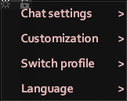

# Chat Settings

In addition to the vanilla settings, OmiChat offers some new settings for players.
With the exception of the [roleplay language](#language-options) settings, these settings will persist across game servers.
You can access the chat settings by clicking on the gear icon at the top right of the chat box.

## Basic settings

Most of the settings within the basic “chat settings” submenu exist in vanilla.
The existing settings work equivalently.
There are two new options added by OmiChat.

**Enable/disable suggestions** can be used to control whether suggestions are offered based on chat box input.

The **retain commands** submenu can be used to determine whether certain commands are “retained,” so that they are set as the initial input the next time the chat is used.
The submenu contains three options: “Chat,” “RP,” and “Other.”
The first option refers to streams such as `/say`, the second refers to streams like [`/me`](../sandbox-options/chat-formats.md#chatformatme), and the third covers all other streams (such as commands).

## Chat customization settings

The chat customization settings can be used to tailor the chat to your preferences.
**Note:** the availability of all options other than chat colors depend on the server's configuration.

The **enable/disable name colors** option allows players to toggle the appearance of name colors in their chat.
This will only display if either the [`EnableSpeechColorAsDefaultNameColor`](../sandbox-options/basic-features.md#enablespeechcolorasdefaultnamecolor) option or the [`EnableSetNameColor`](../sandbox-options/basic-features.md#enablesetnamecolor) option is enabled.

The **enable/disable sign language emotes** option is only shown when the player knows a [signed language](../sandbox-options/languages.md#signedlanguages).
This controls whether a random [emote animation](./emote-shortcuts.md) is played whenever they send a message.
If [character customization](#character-customization) is enabled, this option will be available under that submenu instead.

### Callout customization

The **customize callouts** and **customize sneak callouts** options allow players to set custom messages for when they use callouts (bound to the `Q` key, by default).
These rely on the [`EnableCustomShouts`](../sandbox-options/basic-features.md#enablecustomshouts) option.

  

### Color customization

The **Set chat colors** submenu contains a number of options that allow players to control how the various chat streams display in their chat, as well as the color of their overhead chat messages.

For example, to use orange for messages sent with `/yell`, the **/yell color** option can be used.

If no other chat customization options are enabled, the submenu to set chat colors will be accessible directly from the top-level menu.
The available color customization options depend on server configuration.

## Character customization

If a server has character customization enabled, a submenu that includes QoL character modifications will be available. The available options are self-explanatory.

## Language options

The **Language** submenu will only display for players that know multiple languages or can add new ones.
From this menu, players can select the roleplay language that they want to use in chat.
The currently selected language will be displayed with a checkmark.
The option to add new languages will only be available if a player has more available [language slots](../sandbox-options/languages.md#languageslots) than languages.

Languages other than the default language will display an indicator for the language when used in chat.
Players with characters that don't speak the language will see a chat message indicating that they don't understand it.
