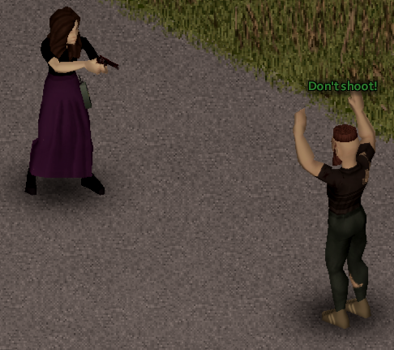

# Emote Shortcuts

The `EnableEmotes` [option](../sandbox-options/basic-features.md#enableemotes) allows players to use emote shortcuts in the form of `.emote` in local chats.
These emote shortcuts cause a player's character to play the animation associated with the emote, but they don't show up in the chat message.

For example, sending the message `Don't shoot! .surrender` would result in the following:

This can be useful for text roleplay servers, since players can play an animation in sync with their message.
The shortcuts can also be used without a message; sending `.hi` will play the animation without sending a message in chat.

## Shortcut list

The following table contains the emotes that are available in the base mod.
Players can use the `/emotes` command to view a list in-game, or enter them using the suggestion box.

| Emote           | Animation                           |
| --------------- | ----------------------------------- |
| `.bye`          | Waving goodbye                      |
| `.ceasefire`    | Signal ceasefire                    |
| `.clap`         | Clapping                            |
| `.comehere`     | Slow beckon                         |
| `.comehere2`    | Fast beckon                         |
| `.comefront`    | Beckoning signal                    |
| `.fire`         | Signal fire                         |
| `.follow`       | Emphatic beckon                     |
| `.followbehind` | Emphatic beckon facing towards back |
| `.followme`     | Same as `.follow`                   |
| `.freeze`       | Signal freeze                       |
| `.hi`           | Greeting wave                       |
| `.hi2`          | Greeting wave (alternative)         |
| `.insult`       | Rude symbol                         |
| `.moveout`      | Signal move out                     |
| `.no`           | Shaking head no                     |
| `.ok`           | Signal okay                         |
| `.salute`       | Formal salute                       |
| `.salute2`      | Casual salute                       |
| `.shout`        | Shouting gesture                    |
| `.shrug`        | Shrug                               |
| `.stop`         | Gesture stop                        |
| `.stop2`        | Signal stop                         |
| `.surrender`    | Hands up in surrender               |
| `.thumbsup`     | Thumbs-up                           |
| `.thumbsdown`   | Thumbs-down                         |
| `.thanks`       | Signal thanks                       |
| `.undecided`    | 50/50 gesture                       |
| `.yes`          | Nodding                             |
